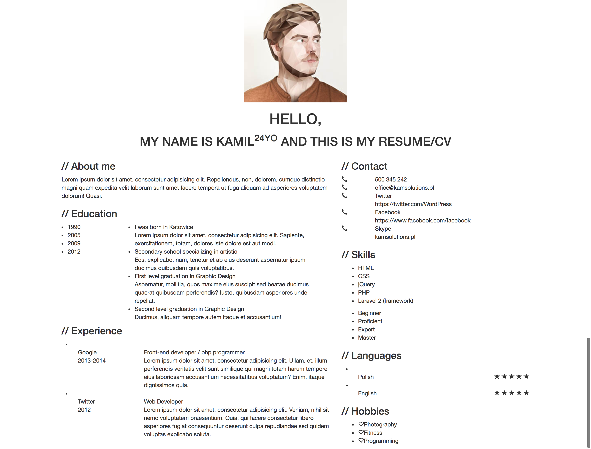

#  练习 - Bootstrap 简历
## 需求说明:

根据[原型图](http://wrapbootstrap.com/preview/WB0265951)，在 `index.html` 中编写 HTML 代码。

## 挑战:

1. 学会使用Bootstrap UI组件

## 要求:

1. 使用 Bootstrap
2. 响应式布局，适配移动端屏幕
3. 布局时先整体后细节
4. 只需实现布局，不要求完善细节
  

## 学习资源:

1. [W3School](http://www.w3school.com.cn/)
2. [Bootstrap](http://www.bootcss.com/)
